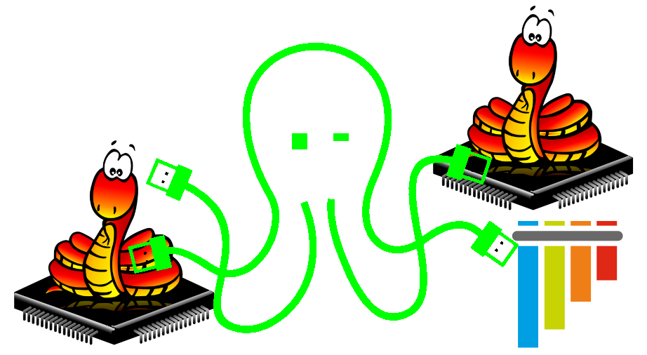
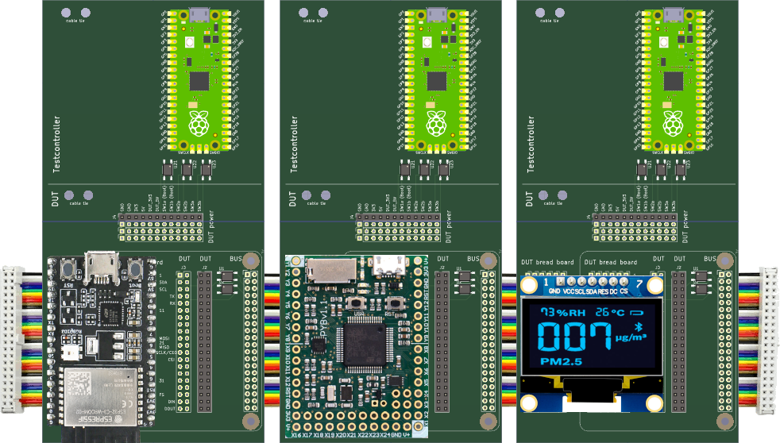
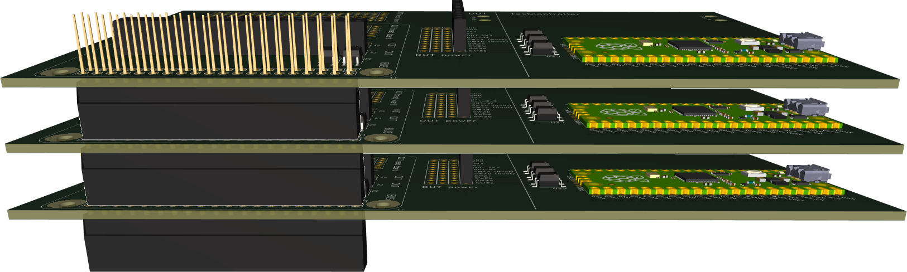
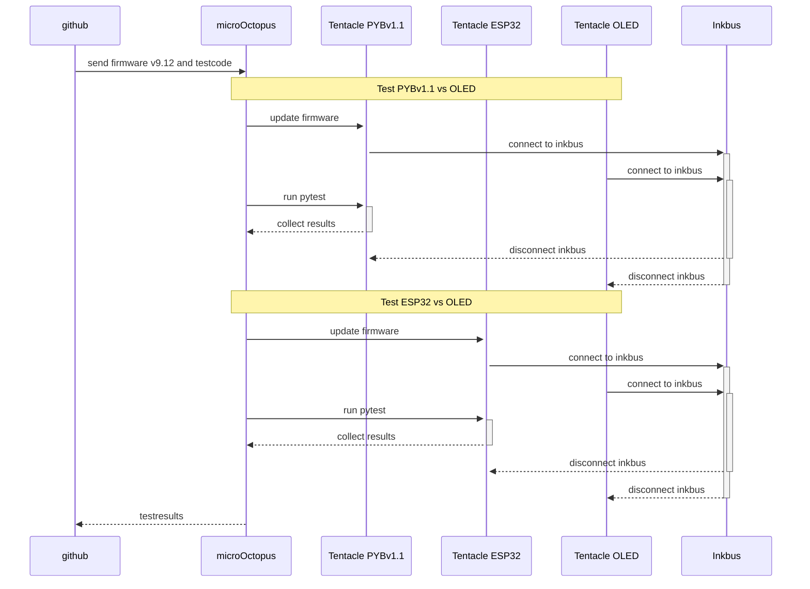

# microOctopus - Micropython Testinfrastructure

Ideas on how to set up a micropython testenvironment

## Terms

See [Terms](design/terms.md)

## Goal

* `microOctopus` allows to automatically test various micropython boards against various gadgets.
* Tests should run automatically and include firmware update.
* Tests should be triggered from the github workflow, for example on commits or pull requests.

## microOctopus testenvironment

* Software:
  * dockerized on linux
  * Test script: `pytest`
  * github runner
* Hardware
  * A tentacle may be ordered assembled at JLCPCB and will cost below USD50.
  * Every tentacle is equipped by a RP2040 which controls the DUT.
  * The Inkbus connects the tentacles. Typically exactly one BoardTentacle and one GadgetTentacle is connected to the Inkbus.
* Extended Hardware
  * microOctopus may also have specialized tentacles like a scope tentacle.
  * microOctopus may also control cams to read displays, wlan hotspot, etc.
* Firmware under test
  * Must be provided by the tester
* Test software
  * microOctopus provides basic functionality like updating firmware, connecting the inkbus, tentacle inventory.
  * However the pytest code itselve is provided by the tester together with the firmware.

## Hardware example

* `microOctopus`
  * `BoardTentacle` PYBv1.1
  * `BoardTentacle` ESP32
  * `GadgetTentacle` OLED

Tentacles side by side connected by a 40 pin ribbon cable

Tentacles stacked

### Above images are just concepts. Below is tentacle v0.1 which I am currently testing.

**Side view**

**Top view**

## Test flow

In this test the OLED display shall be tested agains PYBv1.1 and ESP32 using firmware v9.12.

