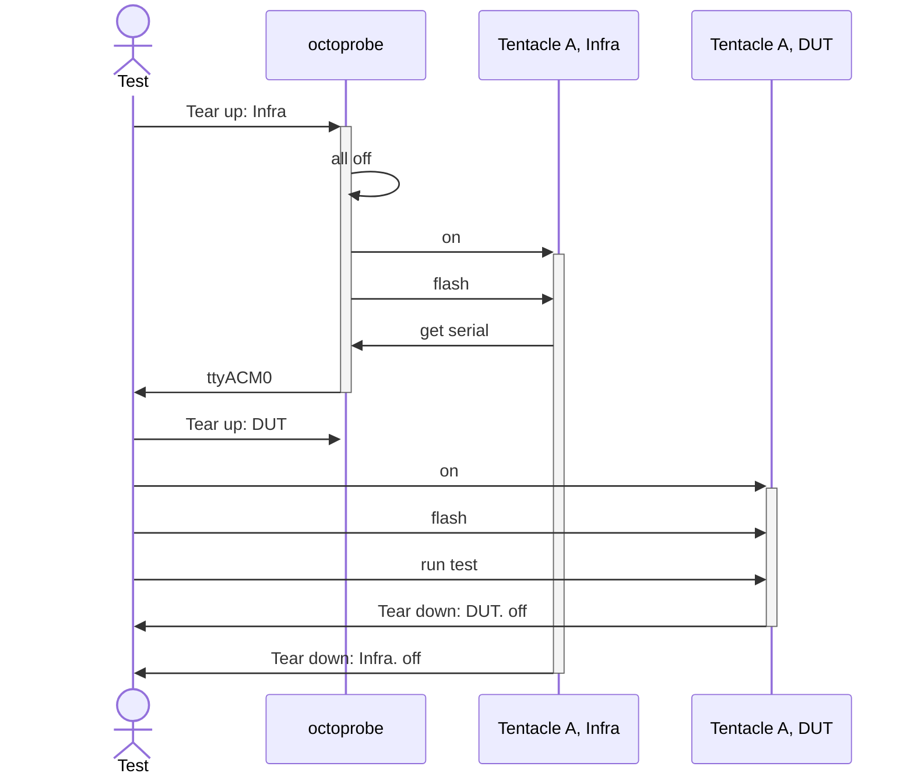
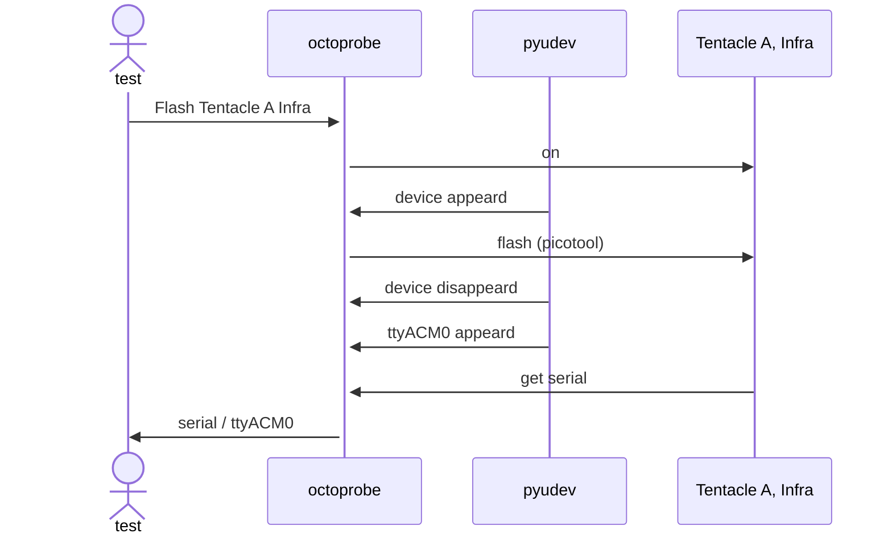

# Test Sequence

```mermaid
sequenceDiagram
    actor t as Test
    participant o as octoprobe
    participant tai as Tentacle A, Infra
    participant tad as Tentacle A, DUT

    t->>+o: Tear up: Infra
    o->>o: all off
    o->>+tai: on
    o->>tai: flash
    tai->>o: get serial
    o->>-t: ttyACM0 

    t->>+o: Tear up: DUT
    t->>+tad: on
    t->>tad: flash
    t->>tad: run test

    tad->>-t: Tear down: DUT. off
    tai->>-t: Tear down: Infra. off
```

## Flash Infra sequence

```mermaid
sequenceDiagram
    actor t as test
    participant o as octoprobe
    participant v as pyudev
    participant tai as Tentacle A, Infra

    t->>+o: Flash Tentacle A Infra
    o->>tai: on
    v->>o: device appeard
    o->>tai: flash (picotool)
    v->>o: device disappeard
    v->>o: ttyACM0 appeard
    tai->>o: get serial
    o->>t: serial / ttyACM0 
```
