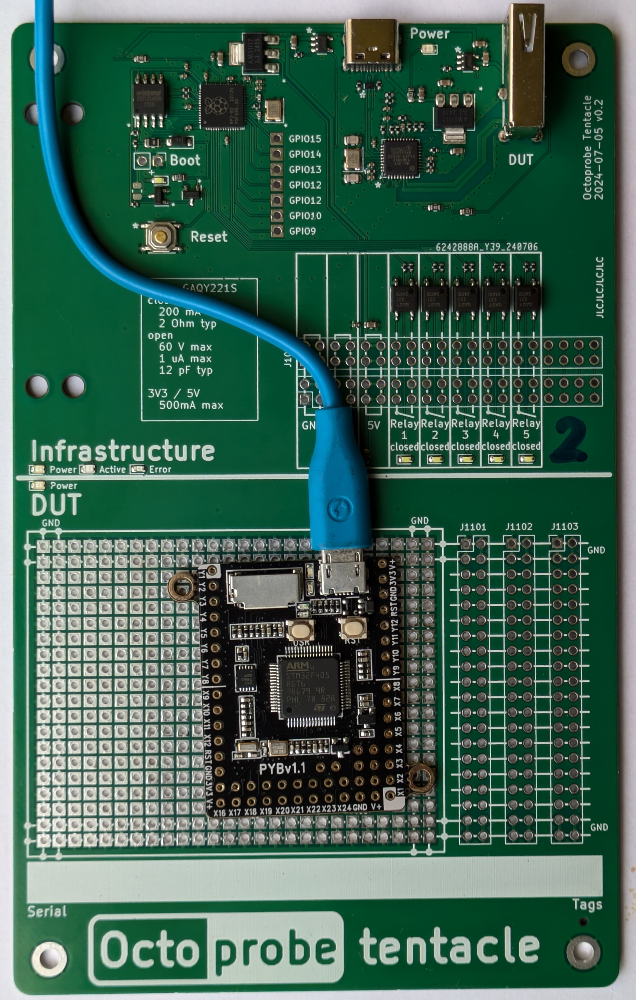

# `TENTACLE_MCU_GROBOTICS_PYBAORD`

## Pins used

| CPU | Pin | signals | rationale |
| - | - | - | - |
| C7 | Y2 | trigger1 | Tim8ch2 |
| B8 | Y3 | trigger2 | Tim4ch3 |
| A2 | X3 | tx | UART(2) |
| A3 | X4 | rx | UART(2) |
| B10 | Y9 | scl/onewire | I2C(2) |
| B11 | Y10 | sda | I2C(2) |
| - | BOOT0 | | |

