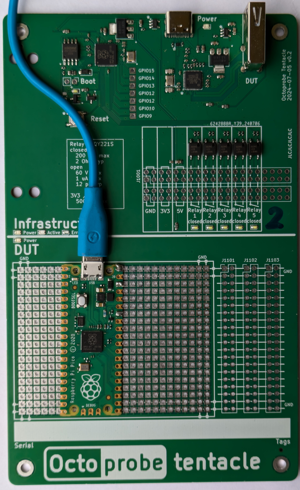

# `TENTACLE_MCU_RASPBERRY_PICO`

## Pins used

| CPU | Pin | signals | rationale |
| - | - | - | - |
| - | BOOTSEL | | |
| GP20 | 26 | trigger1 |  |
| GP21 | 27 | trigger2 |  |
| GP16 | 21 | TX | UART0 |
| GP17 | 22 | RX | UART0 |
| GP19 | 25 | SCL | I2C1 |
| GP18 | 24 | SDA | I2C1 |
| GP14 | 19 | onewire |  |
