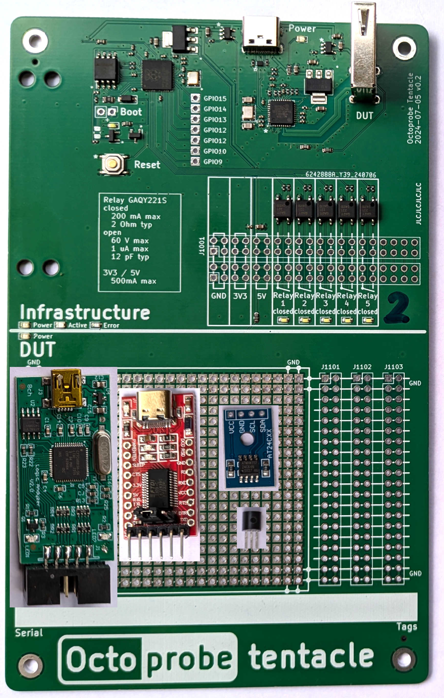

# `TENTACLE_DEVICE_POTPOURRY`

This tentacle comines many features, thus `potpourry`.

## DAQ

The DAQ is read out using sigrok.

In a prober design, the DAQ would be on its own tentacle. But for now it is ok to  

## FUT - Feature Tnder Test

### I2C

The eeprom may be read and write.

### Onewire

The MCU may read out the serial number of the two DS18b temperature sensors.

