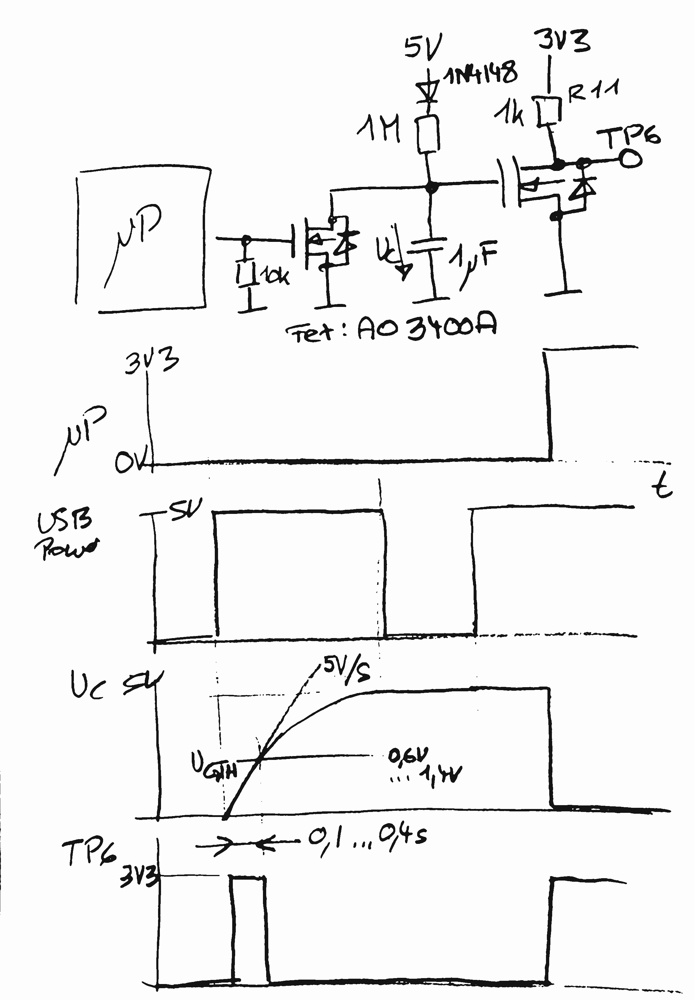

# rp2040 ATM, Bootmode

Every tentacle is controlled by a rp2040 running micropython.

It would be beneficial, if this rp2040 may be reflashed without having to manually press the bootsel button.

## Terms

* Flash mode
* Run mode

* Boot:
  * Capacitor empty -> Run mode
  * Capacitor full -> Flash mode

* Capacitor:
  * Fill: Via R 1M -> 3s
  * Empty: Capacitor on 5V/3V3 100u via R11 1k -> 1s

1k/100u -> tau: 100ms

## Requirements / Use cases

### rp2040 virgin

* precondition: virgin
* precondition: Capacitor empty
* power on -> Run mode
* Wait 5s -> Capacitor full
* power cycle -> Flash mode
* flash -> run mode

### rp2040 normal mode

* precondition: initized ok
* power on -> run mode
* set boot mode gpio to 0 -> capacitor drains
* power cycle -> run mode

### rp2040 normal mode -> reflash

* precondition: initized ok
* power on -> run mode
* set boot mode gpio to 1 -> capacitor drains
* power cycle -> flash mode

### rp2040 crashes

* precondition: buggy image
* power on -> run mode
* boot mode gpio will not be initialzed -> capacitor charges
* power cycle -> flash mode

